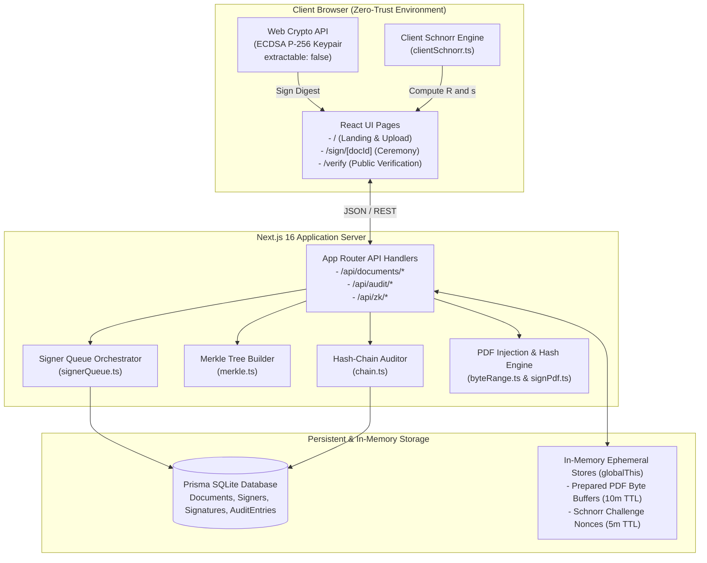
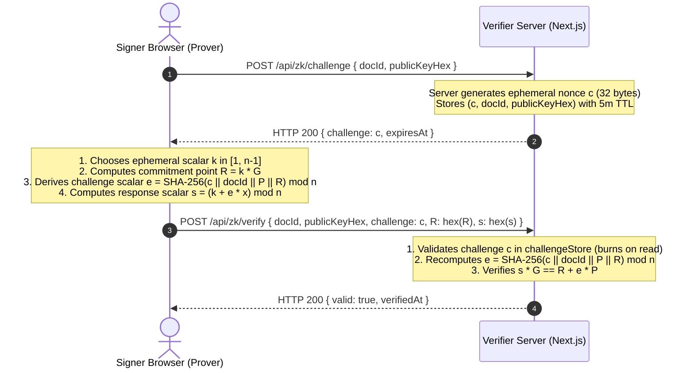

# Meetmux: Zero-Knowledge Document Signer & Verifier
## Complete System Architecture & Cryptographic Specification

**Live Streamlit Deployment:** [https://meetmux-hackathon.streamlit.app](https://meetmux-hackathon.streamlit.app)  
**GitHub Repository:** [https://github.com/alfeenafsal11/meetmux_hackathon](https://github.com/alfeenafsal11/meetmux_hackathon)  
**Core Framework:** Next.js 16 (App Router) + TypeScript + Prisma ORM + Streamlit Cloud

---

## Table of Contents

1. [Executive Summary & Problem Statement](#1-executive-summary--problem-statement)
2. [High-Level Architecture](#2-high-level-architecture)
3. [Cryptographic Specifications](#3-cryptographic-specifications)
   - 3.1 [ECDSA P-256 Digital Signatures](#31-ecdsa-p-256-digital-signatures)
   - 3.2 [Interactive Schnorr Zero-Knowledge Proof (Sigma Protocol)](#32-interactive-schnorr-zero-knowledge-proof-sigma-protocol)
   - 3.3 [Append-Only Hash-Chained Audit Ledger](#33-append-only-hash-chained-audit-ledger)
   - 3.4 [Merkle Tree Root & Inclusion Proofs](#34-merkle-tree-root--inclusion-proofs)
   - 3.5 [PDF Byte-Range Container Injection](#35-pdf-byte-range-container-injection)
4. [Multi-Party Signing Orchestration](#4-multi-party-signing-orchestration)
5. [Database Schema & Data Model](#5-database-schema--data-model)
6. [API Route Reference](#6-api-route-reference)
7. [Threat Model & Security Guarantees](#7-threat-model--security-guarantees)
8. [Automated Verification & Test Suites](#8-automated-verification--test-suites)
9. [Deployment & Local Setup Guide](#9-deployment--local-setup-guide)

---

## 1. Executive Summary & Problem Statement

Conventional electronic signature platforms (e.g., DocuSign, Adobe Sign) suffer from structural architectural vulnerabilities:
- **Centralized Custody & Trust:** Users rely on the platform vendor not to fabricate or manipulate document versions or timestamp logs.
- **Vulnerability to Database Mutation:** If an attacker or malicious administrator modifies records in the backend database, downstream verifiers have no mathematical guarantee to detect the change.
- **Secret Key Exposure:** Traditional web-based signature platforms frequently manage private keys server-side, risking total compromise if server infrastructure is breached.
- **Lack of Zero-Knowledge Identity Proofs:** Proving that an executive possesses the signing key requires either signing an arbitrary challenge text (which can be hijacked into an unintended contract signature) or exposing key material.

**Meetmux solves these issues mathematically:**
1. **Client-Side Key Generation**: Private keys are generated using the Web Crypto API (`extractable: false`) directly in the user's browser; private keys never leave local device memory.
2. **Interactive Schnorr Zero-Knowledge Identification**: Provers prove possession of private key $x$ without revealing $x$ and without signing any document text. Challenges are ephemeral (5-minute TTL) and strictly bound to the document context.
3. **Tamper-Evident Hash-Chained Ledger**: Every state transition cryptographically seals the previous state via $\text{entryHash} = \text{SHA-256}(\text{prevHash} \parallel \text{canonicalJSON}(\text{entry}))$.
4. **Merkle Tree Anchoring**: The entire audit trail is anchored into a server-signed Merkle root, providing logarithmic inclusion proofs ($O(\log N)$).
5. **Unified Verification Metric**: A consolidated `tampered: false` status is derived strictly when `fileHashMatch ∧ allSignaturesValid ∧ auditChainValid` are all true simultaneously.

---

## 2. High-Level Architecture

The platform consists of two interoperable runtime environments:
- **Core Production Web Platform (`zk-doc-signer/`)**: Built on Next.js 16 App Router, TypeScript, Prisma ORM (SQLite/PostgreSQL), Web Crypto API, `@noble/curves/p256`, and `pdf-lib`.
- **Live Interactive Showcase (`streamlit_app.py`)**: Built in Python with `cryptography` and `streamlit` to provide cloud-hosted demonstrations of all cryptographic algorithms, interactive tampering, and zero-knowledge identification.



---

## 3. Cryptographic Specifications

### 3.1 ECDSA P-256 Digital Signatures

All digital signatures in Meetmux use the NIST P-256 elliptic curve (also known as `secp256r1` or `prime256v1`) with SHA-256.

1. **Key Generation**:
   $$\text{Generate } (d, Q) \leftarrow \text{ECDSA.GenerateKey}(\text{P-256}, \text{extractable}=\text{false}, [\text{"sign"}, \text{"verify"}])$$
   - Private key scalar $d \in [1, n-1]$.
   - Public key point $Q = d \cdot G$ where $G$ is the standard P-256 base generator.
   - Public key is exported in uncompressed SubjectPublicKeyInfo (SPKI) PEM/DER format.

2. **Document Digest**:
   $$H = \text{SHA-256}(\text{DocumentBytes})$$

3. **Signature Generation**:
   $$\sigma = (r, s) \leftarrow \text{ECDSA.Sign}(d, H)$$
   - The signature is output in IEEE P1363 raw 64-byte format ($r \parallel s$), where $r$ and $s$ are each 32-byte big-endian integers.

4. **Signature Verification**:
   $$\text{Valid} \leftarrow \text{ECDSA.Verify}(Q, H, (r, s))$$
   - The verifier validates $r, s \in [1, n-1]$, computes $w = s^{-1} \pmod n$, $u_1 = H \cdot w \pmod n$, $u_2 = r \cdot w \pmod n$, and checks that the x-coordinate of $(u_1 \cdot G + u_2 \cdot Q) \pmod n$ equals $r$.

---

### 3.2 Interactive Schnorr Zero-Knowledge Proof (Sigma Protocol)

Meetmux implements a 3-move Interactive Sigma Identification Protocol over NIST P-256 to allow a signer to prove possession of private key $x$ without revealing $x$ and without signing arbitrary messages.



#### Mathematical Protocol Definition:
- **Domain Parameters**: Curve NIST P-256 with base point $G$ and prime subgroup order:
  $$n = \text{0xffffffff00000000ffffffffffffffffbce6faada7179e84f3b9cac2fc632551}$$
- **Prover Secret**: Private key scalar $x \in [1, n-1]$.
- **Prover Public Key**: Point $P = x \cdot G$.

1. **Step 1: Commitment**:
   - Prover samples cryptographically secure random scalar $k \in [1, n-1]$.
   - Prover computes commitment point $R = k \cdot G$ (encoded as uncompressed 65-byte point `04 || x || y`).

2. **Step 2: Challenge**:
   - Verifier issues 32-byte cryptographically random challenge $c$.
   - Challenge scalar $e$ is derived deterministically with domain separation and context binding:
     $$e = \text{SHA-256}(c \parallel \text{docId} \parallel \text{hex}(P) \parallel \text{hex}(R)) \pmod n$$
     *(If $e = 0$, $e$ is set to $1$.)*

3. **Step 3: Response**:
   - Prover computes response scalar:
     $$s = (k + e \cdot x) \pmod n$$

4. **Step 4: Verification**:
   - Verifier checks that $R$ lies on the curve and $s \in [1, n-1]$.
   - Verifier recomputes $e$ using the same context formula.
   - Verifier evaluates the verification identity:
     $$s \cdot G \stackrel{?}{=} R + e \cdot P$$
     *Proof of correctness:*
     $$s \cdot G = (k + e \cdot x) \cdot G = k \cdot G + e \cdot (x \cdot G) = R + e \cdot P$$

5. **Client-Side Security Guarantee**:
   All computations involving $k$, $x$, and $s$ execute strictly inside the user's browser in [clientSchnorr.ts](file:///d:/PROJECTS/Meetmux/zk-doc-signer/src/lib/zk/clientSchnorr.ts). The private key $x$ is never transmitted over HTTP.

---

### 3.3 Append-Only Hash-Chained Audit Ledger

Every document action (`upload`, `sign`, `complete`, `verify`) is registered as an immutable audit record in SQLite. Each record is linked to its immediate predecessor using SHA-256 hash chaining:

$$\text{entryHash}_i = \text{SHA-256}\left(\text{prevHash}_i \parallel \text{canonicalJSON}(E_i)\right)$$

Where:
- $\text{prevHash}_0 = \text{"0000000000000000000000000000000000000000000000000000000000000000"}$ (64 zeroes).
- $\text{canonicalJSON}(E_i)$ serializes keys in strictly deterministic alphabetical order:
  $$\{\text{"action"}: A, \text{"docId"}: D, \text{"metadata"}: M, \text{"signerId"}: S, \text{"timestamp"}: T\}$$

If any past entry $E_j$ ($j < i$) is modified by an attacker in the database, its recalculated $\text{entryHash}_j$ will differ, breaking all downstream hashes:
$$\text{RecalculatedHash}_k \neq \text{StoredEntryHash}_k \quad (\forall k \ge j)$$

---

### 3.4 Merkle Tree Root & Inclusion Proofs

To provide proof of audit entry inclusion without disclosing other entries, the entries for each document are structured into a binary Merkle tree:
- **Leaf Nodes**: $L_i = \text{SHA-256}(\text{entryHash}_i)$.
- **Internal Nodes**: $N = \text{SHA-256}(N_{\text{left}} \parallel N_{\text{right}})$. If a level has an odd number of nodes, the last node is duplicated.
- **Root**: The top-level Merkle root is calculated and digitally signed by the server's master key.
- **Inclusion Proofs**: Logarithmic verification paths $O(\log_2 N)$ allow any party to verify that an event was included in the certified log root without downloading the entire database.

---

### 3.5 PDF Byte-Range Container Injection

To support native PDF signing without modifying already-signed contents, Meetmux implements a structural PDF placeholder injection scheme:
1. **Container Preparation (`POST /api/documents/[id]/upload-pdf`)**:
   - The uploaded PDF is parsed using `pdf-lib`.
   - A structural signature annotation dictionary is injected containing an allocated hex placeholder block (`0000...0000`) for the signature and custom byte offsets.
   - The serialized prepared PDF is stored in an ephemeral in-memory buffer (`preparedPdfCache`, 10-minute TTL).
2. **Byte-Range Hashing (`POST /api/documents/[id]/sign-pdf`)**:
   - The hash of the document excludes the signature placeholder itself:
     $$\text{Digest} = \text{SHA-256}(\text{Bytes}[0 \dots \text{Offset}_1] \parallel \text{Bytes}[\text{Offset}_2 \dots \text{EOF}])$$
   - The signer's ECDSA signature hex is embedded into the allocated placeholder without altering any other byte positions.
3. **Tamper Detection**:
   - Any single-byte modification outside or inside the signature container causes `verifySignedPdf` to detect a digest mismatch and reject the PDF as corrupt.

---

## 4. Multi-Party Signing Orchestration

Meetmux provides two distinct multi-party execution models configured at document creation time:

### 4.1 Sequential Signing Policy (`sequential`)
- Each signer is assigned a strict 1-indexed order (`order = 1, 2, 3, ...`).
- When a signing attempt arrives at `POST /api/documents/[id]/sign`:
  ```typescript
  if (doc.signingMode === 'sequential') {
    const activeSigner = doc.signers.find(s => s.status === 'pending');
    if (activeSigner && activeSigner.id !== signerId) {
      return res.status(403).json({
        error: `Out-of-turn: It is currently ${activeSigner.name}'s turn (order #${activeSigner.order}) to sign.`
      });
    }
  }
  ```
- **Turn Rejection**: Any signer attempting to sign out-of-order receives HTTP 403.
- **Auto-Advancement**: Upon a valid signature from the active signer, their status transitions to `signed`. The next signer in order automatically becomes active.

### 4.2 Parallel Signing Policy (`parallel`)
- Signers belong to an unordered signing set.
- Any designated signer with status `pending` may sign at any time.
- As each signer signs, their status transitions to `signed`.

### 4.3 Completion Transition
For both policies, when all registered signers have completed signing, the document status atomically transitions from `in_progress` to `completed`, generating a final audit entry and closing the signing ceremony.

---

## 5. Database Schema & Data Model

The schema is defined in Prisma (`prisma/schema.prisma`) targeting SQLite (default) and compatible with PostgreSQL:

```prisma
datasource db {
  provider = "sqlite"
  url      = env("DATABASE_URL")
}

generator client {
  provider = "prisma-client-js"
}

model Document {
  id           String       @id @default(cuid())
  name         String
  fileHash     String
  fileSize     Int
  status       String       @default("pending") // pending | in_progress | completed
  signingMode  String       @default("sequential") // sequential | parallel
  createdAt    DateTime     @default(now())
  updatedAt    DateTime     @updatedAt
  signers      Signer[]
  signatures   Signature[]
  auditEntries AuditEntry[]
}

model Signer {
  id           String      @id @default(cuid())
  documentId   String
  name         String
  email        String
  order        Int         @default(1)
  status       String      @default("pending") // pending | signed
  publicKey    String?
  createdAt    DateTime    @default(now())
  document     Document    @relation(fields: [documentId], references: [id], onDelete: Cascade)
  signatures   Signature[]
}

model Signature {
  id           String      @id @default(cuid())
  documentId   String
  signerId     String
  signature    String      // IEEE P1363 raw hex or DER hex
  publicKey    String      // SPKI PEM format
  signedAt     DateTime    @default(now())
  document     Document    @relation(fields: [documentId], references: [id], onDelete: Cascade)
  signer       Signer      @relation(fields: [signerId], references: [id], onDelete: Cascade)
}

model AuditEntry {
  id           String      @id @default(cuid())
  documentId   String
  action       String      // upload | sign | complete | tamper_test
  signerId     String?
  prevHash     String
  entryHash    String
  metadata     String?     // Canonical JSON string
  timestamp    DateTime    @default(now())
  document     Document    @relation(fields: [documentId], references: [id], onDelete: Cascade)
}
```

---

## 6. API Route Reference

### Document Management

| Route | Method | Description |
|---|---|---|
| `/api/documents` | `POST` | Create a new signing session (`name`, `fileHash`, `fileSize`, `signers[]`, `signingMode`). |
| `/api/documents/[id]` | `GET` | Retrieve document metadata, signer queue status, and signatures. |
| `/api/documents/[id]/upload-pdf` | `POST` | Upload PDF binary; injects structural signature placeholder container. |
| `/api/documents/[id]/sign` | `POST` | Submit an ECDSA P-256 signature for a document digest. Enforces queue policies. |
| `/api/documents/[id]/sign-pdf` | `POST` | Embed signature bytes into prepared PDF container and return signed PDF. |
| `/api/documents/[id]/verify` | `GET` | Execute full cryptographic verification: file digest, signatures, and audit chain. |

### Audit & Tamper Detection

| Route | Method | Description |
|---|---|---|
| `/api/audit/[docId]` | `GET` | Fetch complete hash-chained audit log for a document. |
| `/api/audit/root` | `GET` | Compute and return server-signed Merkle tree root over audit entries. |
| `/api/audit/verify-chain` | `POST` | Mathematically re-verify every link in an audit log hash-chain. |
| `/api/audit/simulate-tamper` | `POST` | **Dev-only testing harness** (403 in production). Mutates a DB row to test real-time tamper alarms. |

### Zero-Knowledge Proof (Schnorr Sigma Protocol)

| Route | Method | Description |
|---|---|---|
| `/api/zk/challenge` | `POST` | Issues a cryptographically random challenge nonce $c$ bound to `(docId, publicKey)` with 5m TTL. |
| `/api/zk/verify` | `POST` | Verifies Schnorr identification response: checks $s \cdot G \stackrel{?}{=} R + e \cdot P$ and burns challenge nonce. |
| `/api/zk/prove` | `POST` | **Dev-only testing harness** (403 in production). Exercises proof math server-side with a demo key. |

---

## 7. Threat Model & Security Guarantees

| Threat Vector | Mitigation Strategy | Cryptographic Enforcement |
|---|---|---|
| **Private Key Theft via Network Snooping** | In-browser key generation with Web Crypto API (`extractable: false`). | Private key bytes never touch the HTTP wire. |
| **Out-of-Turn Signing Attack** | Strict server-side queue verification in `signerQueue.ts`. | HTTP 403 returned if unauthenticated or out-of-order signer submits. |
| **Audit Log History Rewriting** | Cryptographic hash chaining + Merkle root anchoring. | Modifying any entry invalidates downstream hashes $\text{entryHash}_k$ and root. |
| **Document Content Substitution** | SHA-256 hashing of exact document bytes checked at signing & verification. | Mismatch triggers `fileHashMatch: false` $\rightarrow$ `tampered: true`. |
| **ZK Challenge Replay Attack** | Challenge nonces stored in `challengeStore` with 5-minute TTL; burned on single use. | Replaying a previous proof response results in HTTP 400 (challenge expired/invalid). |
| **Cross-Document ZK Proof Hijacking** | Challenge derivation scalar $e$ strictly binds `docId`: $e = H(c \parallel \text{docId} \parallel P \parallel R)$. | Proof generated for Document A cannot verify against Document B. |
| **Production Abuse of Test Endpoints** | Code-level and environment-level gating (`NODE_ENV === 'production'`). | `POST /api/audit/simulate-tamper` and `POST /api/zk/prove` return 403; UI hides simulate buttons. |

---

## 8. Automated Verification & Test Suites

The codebase includes **70 automated tests across 7 comprehensive test suites** executed via Vitest:

```bash
$ npm test

 ✓ tests/verification-summary.test.ts (8 tests)
 ✓ tests/zk-schnorr.test.ts (11 tests)
 ✓ tests/ecdsa.test.ts (11 tests)
 ✓ tests/audit-chain.test.ts (18 tests)
 ✓ tests/multi-party.test.ts (10 tests)
 ✓ tests/pdf-sign.test.ts (10 tests)
 ✓ tests/pdf-downloaded.test.ts (2 tests)

 Test Files  7 passed (7)
      Tests  70 passed (70)
```

### Key Test Coverage:
1. **`verification-summary.test.ts`**: Verifies isolated failure modes where each of `fileHashMatch`, `allSignaturesValid`, and `auditChainValid` trigger `tampered: true`, and verifies certificate JSON export format.
2. **`zk-schnorr.test.ts`**: Verifies interactive Schnorr Sigma identification, scalar reduction modulo $n$, challenge nonce binding to `docId`, and replay rejection.
3. **`ecdsa.test.ts`**: Verifies P-256 key generation, SHA-256 digest creation, IEEE P1363 signature verification, and single-bit corruption rejection.
4. **`audit-chain.test.ts`**: Verifies genesis hash initialization, append-only hash linkage, canonical JSON sorting, and Merkle root calculation.
5. **`multi-party.test.ts`**: Verifies sequential turn ordering, HTTP 403 out-of-turn rejection, parallel completion sets, and atomic document finalization.
6. **`pdf-sign.test.ts` & `pdf-downloaded.test.ts`**: Verifies PDF container injection, byte-range hashing, signature embedding, and single-bit tamper rejection on signed PDF files.

---

## 9. Deployment & Local Setup Guide

### 9.1 Live Cloud Deployment (Streamlit Community Cloud)

- **Application URL:** [https://meetmux-hackathon.streamlit.app](https://meetmux-hackathon.streamlit.app)
- **Repository:** `alfeenafsal11/meetmux_hackathon` (branch `main`)
- **Main Entrypoint:** `streamlit_app.py`
- **Dependencies:** `cryptography>=41.0.0`, `streamlit>=1.30.0`

### 9.2 Running Locally

#### 1. Next.js Core Application (`zk-doc-signer`)
```bash
# Clone the repository
git clone https://github.com/alfeenafsal11/meetmux_hackathon.git
cd meetmux_hackathon/zk-doc-signer

# Install dependencies
npm install

# Run database migrations
npx prisma migrate dev

# Start development server
npm run dev
# Application will be accessible at http://localhost:3000

# Run all 70 cryptographic test suites
npm test
```

#### 2. Streamlit Dashboard App
```bash
# In the repository root
cd meetmux_hackathon

# Install Python requirements
pip install -r requirements.txt

# Launch Streamlit app
streamlit run streamlit_app.py
# Application will open at http://localhost:8501
```

---

## 10. Summary Checklist of Core Deliverables

- [x] **Phase 0:** Project Scaffolding, TypeScript types, Prisma SQLite database schema & migrations.
- [x] **Phase 1:** In-browser Web Crypto ECDSA P-256 signing, public key SPKI export, server-side signature verification.
- [x] **Phase 2:** Append-only hash-chained audit trail, canonical JSON hashing, Merkle tree root anchoring, adversarial tamper simulation.
- [x] **Phase 3:** PDF structural container injection, `/ByteRange` placeholder allocation, incremental signature embedding, single-bit tamper detection.
- [x] **Phase 4:** Multi-party signing orchestration, sequential turn enforcement with HTTP 403 out-of-turn rejection, parallel unordered sets.
- [x] **Phase 5:** Interactive Schnorr Zero-Knowledge Proof protocol (NIST P-256), 100% in-browser proof computation, ephemeral challenge store with 5m TTL.
- [x] **Phase 6:** Public `/verify` dashboard, consolidated `tampered` badge derivation, downloadable verification certificate, complete demo script.
- [x] **Cloud Deployment:** GitHub repository published, Streamlit Community Cloud deployed live with dark theme and interactive tabs.
