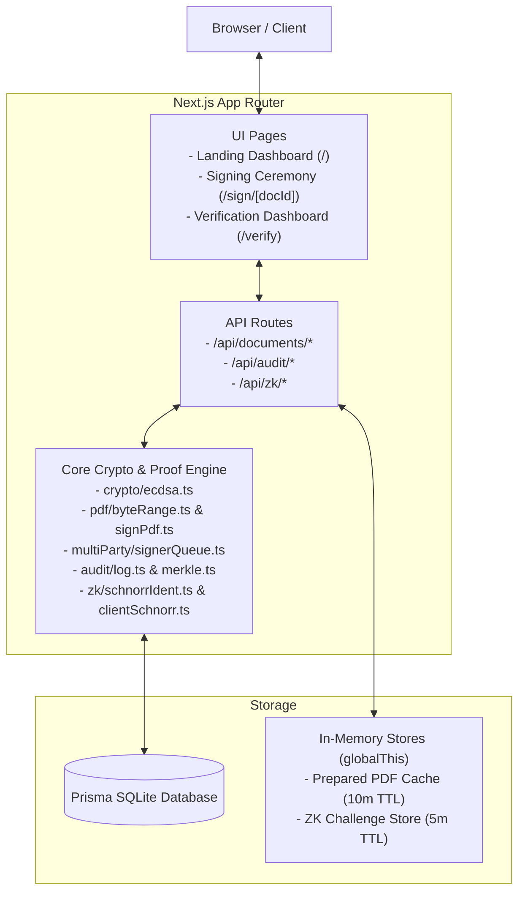

# ZK Doc Signer

**Zero-Knowledge Document Signing & Cryptographic Verification Platform**

> 🚀 **Live Streamlit Deployment:** [https://meetmux-hackathon.streamlit.app](https://meetmux-hackathon.streamlit.app)  
> 🔗 **GitHub Repository:** [https://github.com/alfeenafsal11/meetmux_hackathon](https://github.com/alfeenafsal11/meetmux_hackathon)

A production-grade Next.js application that provides multi-party cryptographic document signing with ECDSA (P-256), tamper-evident hash-chained audit trails with Merkle tree anchoring, Interactive Schnorr Zero-Knowledge Proofs of key possession, and a public verification dashboard with downloadable cryptographic proof certificates.

---

## Technical Stack

| Layer | Technology |
|-------|-----------|
| **Framework** | Next.js 16 (App Router) + TypeScript |
| **Cryptography** | Web Crypto API (ECDSA P-256 / SHA-256), `@noble/curves/p256` (Interactive Schnorr Protocol) |
| **PDF Engine** | `pdf-lib` (byte-offset container injection, incremental signing) |
| **Database** | Prisma ORM + SQLite (`DATABASE_URL="file:./dev.db"`, easily swappable to Postgres) |
| **Test Runner** | Vitest (70 unit and end-to-end cryptographic tests across 7 suites) |

---

## System Architecture



For detailed architectural flow diagrams, see [docs/architecture-diagram.md](docs/architecture-diagram.md).

---

## Core Features Implemented

1. **Core ECDSA P-256 Signing (Phase 1)**:
   - In-browser key generation with Web Crypto API (`extractable: false`).
   - Server-side key verification against SHA-256 document digests.
2. **Tamper-Evident Audit Trail (Phase 2)**:
   - Append-only hash-chained ledger: $\text{entryHash} = \text{SHA-256}(\text{prevHash} \parallel \text{canonicalJSON}(\text{entry}))$.
   - Server-signed Merkle tree root over log entries with inclusion proofs.
   - Interactive live database tamper simulation (`POST /api/audit/simulate-tamper`) for instant detection demonstrations.
3. **PDF Byte-Range Signing (Phase 3)**:
   - Structural placeholder container injection and `/ByteRange` hashing.
   - Incremental signature embedding and tamper rejection on single-bit byte modifications.
4. **Multi-Party Signing Workflows (Phase 4)**:
   - **Sequential Mode**: Strict queue order enforced server-side. Signers attempting to sign out-of-turn receive HTTP 403. Queue auto-advances.
   - **Parallel Mode**: Unordered set where any designated signer may sign in any order.
   - Document auto-advances to `completed` once all designated signers have signed.
5. **Interactive Schnorr Zero-Knowledge Proof Layer (Phase 5)**:
   - 3-move Sigma identification protocol over NIST P-256.
   - Prover proves possession of private key without revealing the key or signing any document text.
   - Proof generated **100% in-browser** via `clientSchnorr.ts` (private key never transmitted).
   - Single-use challenge nonces with 5-minute TTL bound to `docId` with burn-on-verify replay protection.
6. **Verification Dashboard & Demo Packaging (Phase 6)**:
   - Public `/verify` dashboard with a single consolidated **"tampered: true/false"** summary derived from `fileHashMatch + allSignaturesValid + auditChainValid`.
   - Downloadable **Verification Certificate** (JSON export summarizing document metadata, all signatures, and audit trail).
   - Interactive signing ceremony UI at `/sign/[docId]`.

---

## Quick Start & Running Locally

### 1. Prerequisites
- Node.js `>=20.0.0` (`crypto.subtle` support).

### 2. Setup & Installation
```bash
# Clone and enter directory
cd zk-doc-signer

# Install dependencies
npm install

# Run database migrations
npx prisma migrate dev

# Start the persistent development server
npm run dev
# Server listening on http://localhost:3000
```

### 3. Run Test Suite
```bash
npm test
# Runs 70 tests across 7 test suites with Vitest
```

---

## Complete Demo Walkthrough

A step-by-step click script explaining how to upload documents, test out-of-turn rejection, execute in-browser ZK proofs, simulate live database tampering, and export certificates is available in:

👉 **[docs/demo-script.md](docs/demo-script.md)**

---

## Known Design Decisions & Constraints

1. **PDF Scheme**: Uses a structural signature container (`ZkSigInfo`) with custom byte offsets verified by `verifySignedPdf`, rather than a standard Adobe/PAdES `/ByteRange` signature dictionary. Full PDF/A-3 conversion is explicitly out of scope per plan.
2. **Persistent Server Constraint**: Ephemeral ZK challenges and the prepared PDF serialization cache are bound to `globalThis` in memory. Run as a single persistent server process for local demonstration.
3. **Dev-Only Test Endpoints**: `POST /api/audit/simulate-tamper` and `POST /api/zk/prove` are gated as dev-only testing harnesses and return HTTP 403 in production. In production UI workflows, Schnorr proofs are computed strictly client-side in the browser.
4. **Scope Boundary**: Phase 7 (blockchain anchoring, WebAuthn, GG18 threshold ECDSA) is strictly out of scope unless approved.
