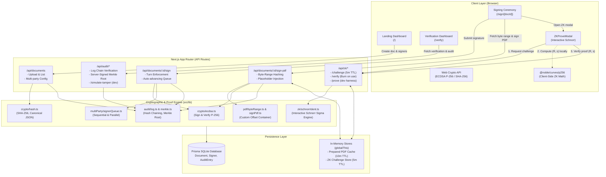

# ZK Doc Signer — System Architecture

---

## Architectural Highlights

1. **Pure In-Browser Zero-Knowledge Prover**:
   The user's private key never leaves the client browser. `ZKProveModal` executes `@noble/curves/p256` locally to compute the commitment $R = k \cdot G$ and scalar response $s = (k + e \cdot x) \pmod n$. Only $(R, s)$ are submitted across the network to `/api/zk/verify`.
2. **Context-Bound Ephemeral Challenges**:
   Server challenges are single-use nonces bound to `docId` with a 5-minute TTL. The challenge scalar $e = \text{SHA-256}(\text{nonce} \parallel \text{docId} \parallel P \parallel R) \pmod n$ mathematically binds the proof to the session and burns upon first verification to prevent replay attacks.
3. **Multi-Party Policy Enforcement**:
   - **Sequential Mode**: Strict queue order is enforced server-side. Signers attempting to sign out-of-turn receive HTTP 403. Queue auto-advances upon successful signing.
   - **Parallel Mode**: Unordered set where any designated signer may sign in any order.
   - The document automatically transitions to `completed` once all designated signers have signed.
4. **Append-Only Tamper-Evident Audit Chain**:
   Each entry is cryptographically chained via $\text{entryHash} = \text{SHA-256}(\text{prevHash} \parallel \text{canonicalJSON}(\text{entry}))$. A binary Merkle tree is computed over entry hashes, and the root is signed by the server key. Tampering with any historical entry breaks the hash chain and is immediately flagged by the verification dashboard.
5. **Consolidated Tamper Detection Summary**:
   The `/verify` dashboard derives a single, unified `tampered: true/false` status combining file hash matching, ECDSA signature validity, and audit chain integrity.
